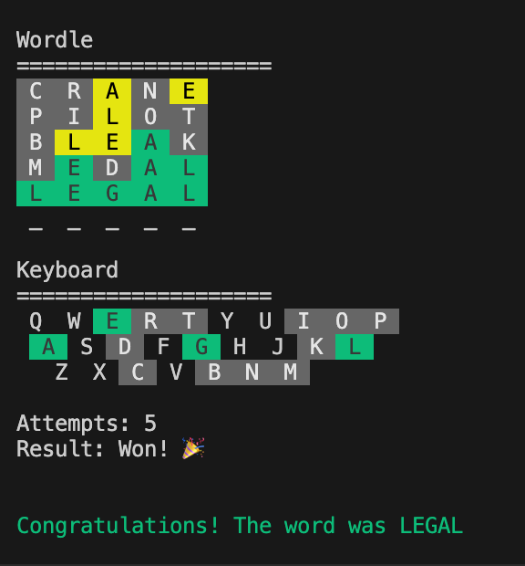

# Command-Line Wordle

A Python implementation of the popular Wordle game that runs in the terminal.

[](https://www.python.org/downloads/)
[](https://opensource.org/licenses/MIT)
[](https://github.com/psf/black)

[📖 Detailed User Guide](DOCS.md)



## Features

- Command-line interface with color support
- 6 attempts to guess a 5-letter word
- Visual feedback using colors or symbols
- Word validation
- Cross-platform compatibility

## Requirements

- Python 3.8 or higher
- pip for package installation

## Installation

1. Clone the repository:
```bash
git clone <repository-url>
cd wordle
```

2. Create and activate a virtual environment:
```bash
# On Unix/macOS
python -m venv venv
source venv/bin/activate

# On Windows
python -m venv venv
venv\Scripts\activate
```

3. Install dependencies:
```bash
pip install -r requirements.txt
```

## Usage

To start the game:
```bash
python -m src.cli
```

## How to Play

1. The game will select a random 5-letter word
2. You have 6 attempts to guess the word
3. After each guess, you'll receive feedback:
   - ✓ (Green): Letter is correct and in the right position
   - ○ (Yellow): Letter is in the word but in the wrong position
   - ✗ (Gray): Letter is not in the word

## Development

### Running Tests
```bash
# Run all tests
pytest

# Run with coverage report
pytest --cov=src tests/

# Run specific test file
pytest tests/test_end_to_end.py
```

### Contributing

1. Fork the repository
2. Create a feature branch (`git checkout -b feature/amazing-feature`)
3. Make your changes
4. Run tests to ensure everything works
5. Commit your changes (`git commit -m 'Add amazing feature'`)
6. Push to the branch (`git push origin feature/amazing-feature`)
7. Open a Pull Request

### Code Style

This project follows the Black code style. To format your code:
```bash
black .
```

### Project Structure
```
wordle/
├── src/
│   ├── __init__.py
│   ├── cli.py           # Command-line interface
│   ├── controller.py    # Game controller
│   ├── word_manager.py  # Word handling
│   ├── display.py       # Display formatting
│   └── state.py         # Game state
├── tests/
│   ├── __init__.py
│   ├── test_cli.py
│   ├── test_controller.py
│   ├── test_word_manager.py
│   └── test_display.py
├── data/
│   └── words.txt        # Word dictionary
├── requirements.txt
└── README.md
```

## License

This project is open source and available under the MIT License.
