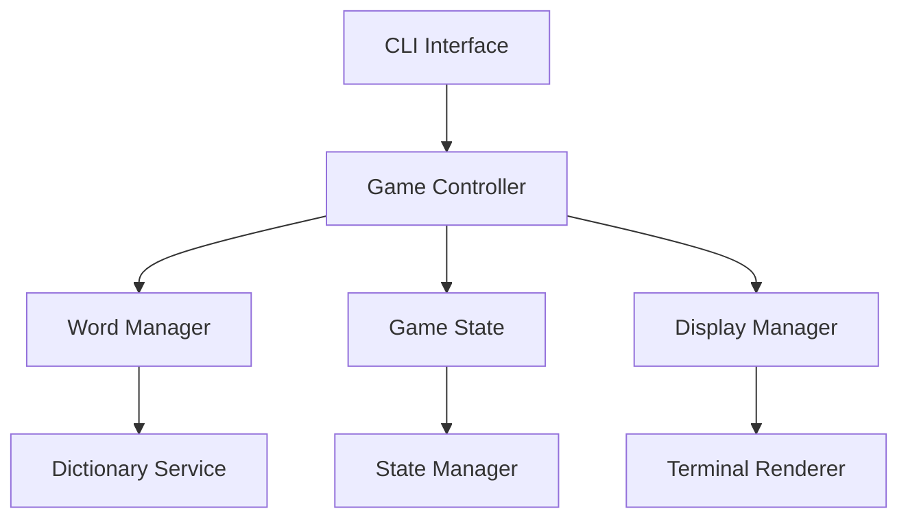
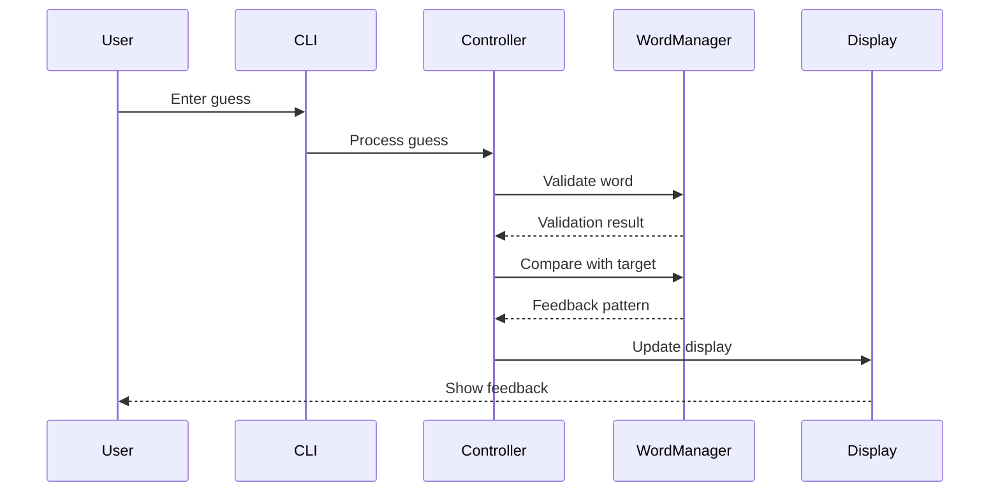

# System Patterns: Command-Line Wordle

## Architecture Overview ✅

## Component Responsibilities ✅

### CLI Interface
- Handle user input
- Parse commands
- Validate input format
- Route to appropriate game actions
- Display game output
- Show error messages

### Game Controller
- Coordinate game flow
- Process game logic
- Manage turn sequence
- Track game progress
- Handle win/lose conditions
- Generate feedback patterns

### Word Manager
- Select target words
- Validate guessed words
- Compare guess with target
- Generate feedback patterns
- Manage word dictionary
- Handle case normalization

### Display Manager
- Format game output
- Handle color/symbol rendering
- Manage screen updates
- Format feedback display
- Support color/no-color modes
- Render keyboard state

### State Manager
- Track current game state
- Store game progress
- Manage game history (future)
- Handle save/load (future)
- Track used letters
- Monitor game status

## Design Patterns ✅

### Model-View-Controller (MVC)
- Model: Game state and word management
- View: Display formatting and rendering
- Controller: Game logic and flow control

### Observer Pattern
- Game state updates trigger display updates
- Input events trigger game state changes
- Keyboard display reflects letter states

### Strategy Pattern
- Pluggable display strategies (colors/symbols)
- Configurable word selection strategies
- Flexible feedback formatting

### Factory Pattern
- Game state creation
- Display renderer creation
- Word validator creation

## Data Flow ✅

## Technical Patterns ✅

### Error Handling
- Input validation at CLI level
- Game state validation in controller
- Word validation in word manager
- Display fallbacks in renderer
- Clear error messages
- Recovery procedures

### State Management
- Immutable game state
- State transitions through controller
- History tracking for undo/redo (future)
- Event-driven updates
- Clear state transitions

### Configuration
- External word dictionary
- Display preferences
- Game rules configuration
- Color scheme settings
- Fallback options

## Testing Strategy ✅

### Unit Tests
- Word validation logic
- Game state transitions
- Feedback generation
- Display formatting
- Input processing
- State management

### Integration Tests
- Game flow sequences
- State management
- Display rendering
- Input processing
- Component interaction

### End-to-End Tests
- Complete game scenarios
- Error handling paths
- Save/load operations (future)
- User interaction flows

## Performance Considerations

### Memory Management
- Efficient word dictionary storage
- Minimal state copying
- Smart display updates
- Cached validations

### Response Time
- Quick word validation
- Immediate feedback display
- Efficient state updates
- Fast rendering

## Security Considerations

### Input Validation
- Sanitize all user input
- Validate word dictionary
- Check file operations
- Prevent buffer overflows

### Data Protection
- Secure save files (future)
- Protected word lists
- Safe state management
- File integrity checks

## Implementation Status

### Completed
- Basic architecture setup
- Component structure
- Interface definitions
- Test framework
- Core patterns

### In Progress
- Game loop implementation
- Display system completion
- State management
- Error handling

### Upcoming
- Full game flow
- Complete display system
- State persistence
- Advanced features
